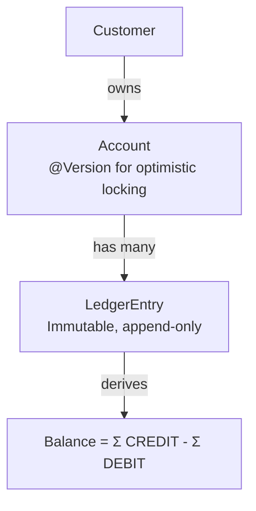

# Del/Finanz - Banking Domain Model

A showcase of domain-driven design principles applied to a banking system. Event-sourced ledger, immutable transactions, idempotent transfers, and optimistic concurrency control.

## Quick Start

```bash
./mvnw spring-boot:run
```

Open http://localhost:8080/swagger-ui.html for interactive API docs.

**Live API docs:** https://er5atz.github.io/delfin/

## Try It

After starting the app, try the transfer flow:

```bash
# Create a customer
curl -s -X POST http://localhost:8080/api/customers \
  -H "Content-Type: application/json" \
  -d '{"firstName":"Max","lastName":"Mustermann"}'

# Deposit funds (replace ACCOUNT_ID)
curl -s -X POST http://localhost:8080/api/accounts/ACCOUNT_ID/entries \
  -H "Content-Type: application/json" \
  -H "Idempotency-Key: deposit-001" \
  -d '{"type":"CREDIT","amount":1000.00,"currency":"EUR","description":"Initial deposit"}'

# Transfer (replay-safe via Idempotency-Key)
curl -s -X POST http://localhost:8080/api/transfers \
  -H "Content-Type: application/json" \
  -H "Idempotency-Key: transfer-001" \
  -d '{"sourceAccountId":"ACC1","destinationAccountId":"ACC2","amount":250.00,"currency":"EUR","description":"Rent"}'
```

For the full flow with all endpoints, see [`http/transfer-flow.http`](http/transfer-flow.http) (works in IntelliJ and VS Code REST Client).

## API Overview

| Method | Path | Description |
|--------|------|-------------|
| POST | `/api/customers` | Create customer |
| GET | `/api/customers/{id}` | Get customer with accounts |
| POST | `/api/accounts` | Create account |
| GET | `/api/accounts/{id}` | Get account with balance |
| GET | `/api/accounts/{id}/entries` | List ledger entries (paginated) |
| POST | `/api/accounts/{id}/entries` | Deposit or withdraw |
| POST | `/api/transfers` | Transfer between accounts |

## Design Decisions

Each design choice is documented in an Architecture Decision Record:

- [ADR 001: Event-Sourced Ledger](docs/adr/001-event-sourced-ledger.md) - balance derived from immutable entries
- [ADR 002: No Authentication](docs/adr/002-no-authentication.md) - public API for showcase simplicity
- [ADR 003: Optimistic Locking](docs/adr/003-optimistic-locking.md) - concurrent transfer safety
- [ADR 004: Idempotency](docs/adr/004-idempotency.md) - safe request retries

## Architecture



## Tech Stack

- Java 21
- Spring Boot 3.5.14
- Spring Data JPA with Hibernate 6
- Spring HATEOAS
- H2 in-memory database
- Flyway migrations
- Springdoc OpenAPI (Swagger UI)
- JUnit 5 + Mockito + AssertJ

## Running Tests

```bash
./mvnw test
```

Test coverage: domain model (unit), services (unit), API layer (integration).

## License

MIT
